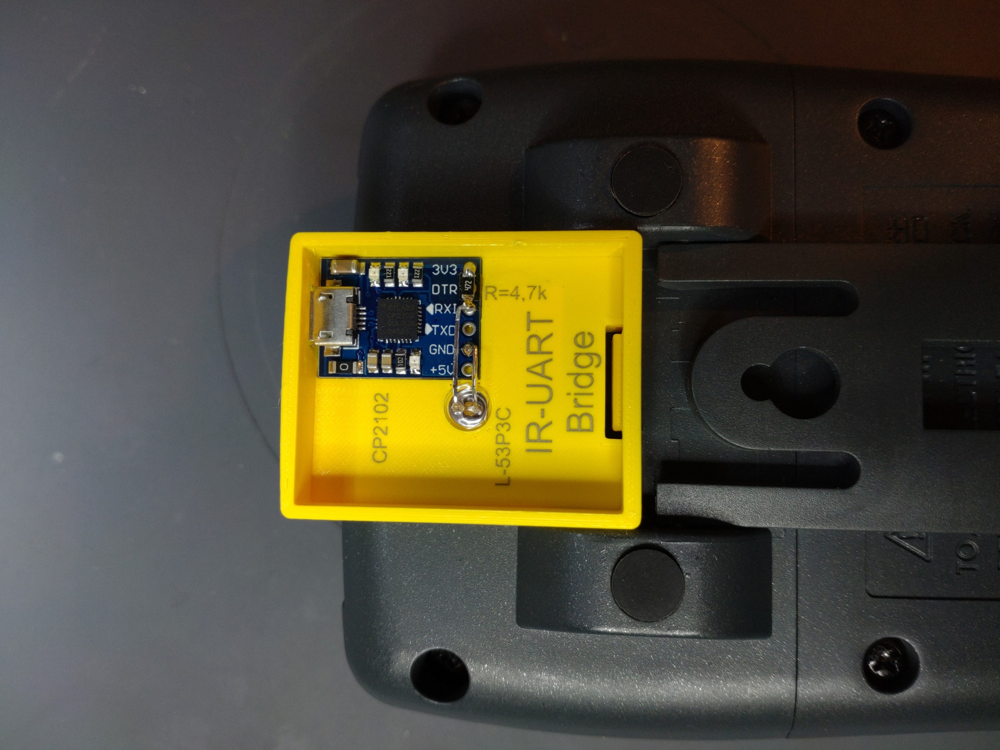
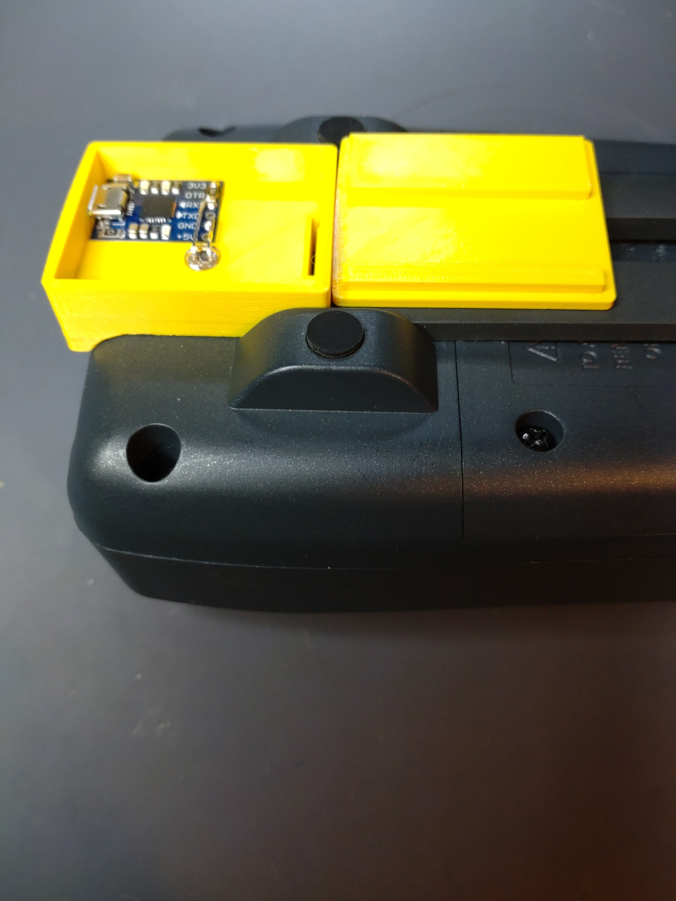
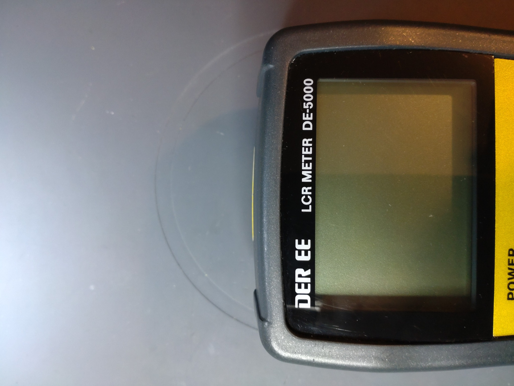
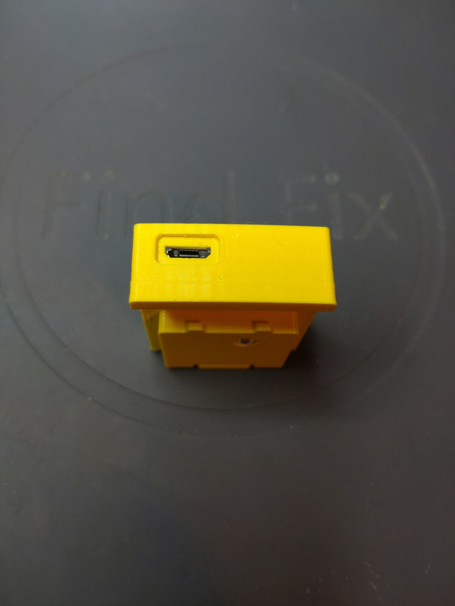
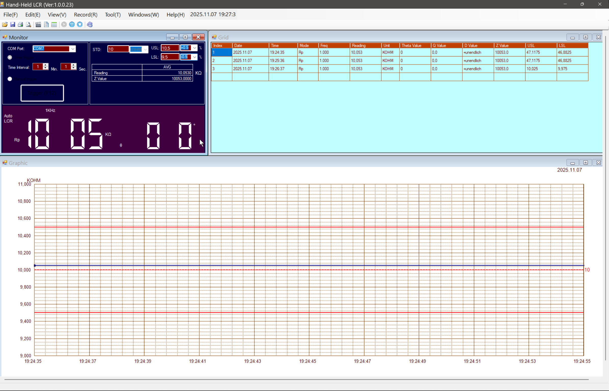

# DER-DE-5000-IR-UART-TTL-Adapter
3D printable IR-UART TTL Adapter to connect DER DE-5000 LCR Meter to PC. 

I stumbled across a thread on eevblog-forum about a Software to connect DER DE-5000 using a selfmade Infrared-UART TTL bridge.
There was a 3D printable enclosre. Since i own a DER DE-5000 LCR Meter, i redesigned the enclosure a bit to fit the conture of the device.

The enclose consists of two parts that clamp together. When inserting the adapter, press a bit harder until it snaps.
Inside is a CP2102 UART adapter, a L-53P3C IR phototransistor (long leg connected to GND, short leg connected to RX) and a 4,7k Ohm resistor.
The resistor can have any value between 1k and 10k. I choose the 4,7k one because i have plenty of them.
I used some Kapton tape under the resistor.

The software can be found on the internet. Should also work with TestController (well known java app).
I use 19200 baud 8N1, and on Windows, i disabled power saving in device manager for this device.

 
 

 
 

 
 

 

